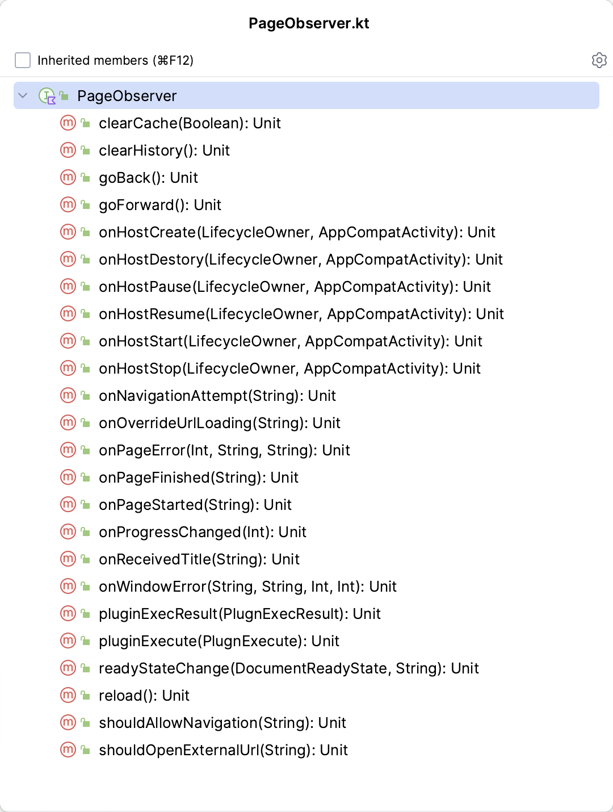

# CordovaWebView

基于Android端CordovaLib的封装，在保留cordova原有功能的基础上，摆脱了必须继承CordovaActivity的限制，大幅提升UI的灵活度，可以像使用webview一样使用在Activity、Fragment甚至是自定义View中使用Cordova的能力。
同时，在原有的基础上提供更加丰富的事件回调，可应用于更加丰富的业务场景中。

## 核心优势

* 解决了必须继承的Activity的问题，粒度小，可以像使用webview一样使用，适用于任何个性化的ui
* 提供了丰富的事件回调

## 运行示例


## 使用

#### 添加依赖

```kotlin
implementation("com.xeonyu:cordova-webcontainer:1.0.7")
```

#### 继承CordovaWebContainerActivity使用

该方式适用于绝大部分业务场景，集成简单，兼顾ui灵活性

布局示例

```xml
<?xml version="1.0" encoding="utf-8"?>
<androidx.constraintlayout.widget.ConstraintLayout xmlns:android="http://schemas.android.com/apk/res/android"
    xmlns:app="http://schemas.android.com/apk/res-auto"
    xmlns:tools="http://schemas.android.com/tools"
    android:layout_width="match_parent"
    android:layout_height="match_parent"
    tools:context="com.yzq.demo.activity.WebContainerActivity">

    <!--标题栏-->
    <androidx.appcompat.widget.Toolbar
        android:id="@+id/toolbar"
        android:layout_width="match_parent"
        android:layout_height="wrap_content"
        android:background="@color/purple_200"
        app:layout_constraintStart_toStartOf="parent"
        app:layout_constraintTop_toTopOf="parent"
        app:titleTextColor="@color/white" />

    <!--进度条-->
    <ProgressBar
        android:id="@+id/progressbar"
        style="@android:style/Widget.ProgressBar.Horizontal"
        android:layout_width="match_parent"
        android:layout_height="5dp"
        app:layout_constraintStart_toStartOf="parent"
        app:layout_constraintTop_toBottomOf="@id/toolbar" />

    <!--基于Cordova封装的web容器控件-->
    <com.yzq.cordova_webcontainer.CordovaWebContainer
        android:id="@+id/web_container"
        android:layout_width="match_parent"
        android:layout_height="0dp"
        app:layout_constraintBottom_toBottomOf="parent"
        app:layout_constraintTop_toBottomOf="@id/progressbar"
        app:layout_goneMarginTop="5dp" />

    <!--浮动按钮-->
    <com.google.android.material.floatingactionbutton.FloatingActionButton
        android:id="@+id/reload_fab"
        android:layout_width="wrap_content"
        android:layout_height="wrap_content"
        android:layout_margin="16dp"
        android:contentDescription="刷新"
        android:src="@drawable/refresh"
        android:tint="@color/white"
        app:layout_constraintBottom_toBottomOf="parent"
        app:layout_constraintEnd_toEndOf="parent" />
</androidx.constraintlayout.widget.ConstraintLayout>
```

代码示例：

```kotlin
/**
 * @description 继承自WebcontainerActivity的使用示例
 * @author  yuzhiqiang (zhiqiang.yu.xeon@gmail.com)
 */

class WebContainerActivity : CordovaWebContainerActivity() {
    private lateinit var binding: ActivityWebContainerBinding
    private val TAG = "WebContainerActivity"

    /*布局初始化*/
    override fun initContentView() {
        binding = ActivityWebContainerBinding.inflate(layoutInflater)
        setContentView(binding.root)
    }


    /*初始化Webcontainer控件*/
    override fun initWebContainer(): CordovaWebContainer {
        with(binding) {
            webContainer.run {
                /**
                 * 初始化webcontainer
                 */
                init(this@MainActivity, LOG.VERBOSE)

             
        return binding.webContainer
    }


    override fun onCreate(savedInstanceState: Bundle?) {
        super.onCreate(savedInstanceState)
        val url = "https://baidu.com/"
        binding.webContainer.loadUrl(url)
        binding.webContainer.setOnPageScrollChangedListener { xOffset, yOffset, oldxOffset, oldyOffset ->
            Log.i(TAG, "yOffset:$yOffset,oldyOffset:$oldyOffset")
        }
        binding.reloadFab.setOnClickListener {
            binding.webContainer.reload()

        }
    }

}
```

#### 在Fragment中使用

支持在Fragment中使用，继承`CordovaWebContainerFragment`即可，api跟`CordovaWebContainerActivity`
一致。需要注意的是Fragment的宿主Activity需要处理下页面结果回调的方法。

宿主的Activity中重写下面两个方法，写法固定

```kotlin
override fun onActivityResult(requestCode: Int, resultCode: Int, data: Intent?) {
        super.onActivityResult(requestCode, resultCode, data)
      
        currentFragment?.onActivityResult(requestCode, resultCode, data)
    }

    override fun onRequestPermissionsResult(
        requestCode: Int,
        permissions: Array<out String>,
        grantResults: IntArray,
    ) {
        super.onRequestPermissionsResult(requestCode, permissions, grantResults)
      
        currentFragment?.onRequestPermissionsResult(requestCode, permissions, grantResults)
    }
```

Fragment正常使用即可，示例代码

```kotlin
package com.yzq.demo.fragment

/**
 * @description 在Fragment中使用示例
 * @author  yuzhiqiang (zhiqiang.yu.xeon@gmail.com)
 */

class WebContainerFragment(val webUrl: String) : CordovaWebContainerFragment() {
    private lateinit var rootView: View
    private lateinit var webContainer: CordovaWebContainer

    override fun initContentView(
        inflater: LayoutInflater,
        container: ViewGroup?,
        savedInstanceState: Bundle?,
    ): View {
        rootView = layoutInflater.inflate(R.layout.fragment_web_container, container, false)
        return rootView
    }

    override fun initWebContainer(): CordovaWebContainer {
        webContainer = rootView.findViewById(R.id.web_container)
        webContainer.init(requireActivity() as AppCompatActivity, LOG.VERBOSE)
        return webContainer
    }

    override fun initWidget() {
        if (webUrl.isNotEmpty()) {
            webContainer.loadUrl(url = webUrl)
        } else {
            webContainer.loadUrl()
        }
    }


}
```

#### 作为自定义view使用

如果你不希望继承指定的Activity，你可以把`CordovaWebContainer`作为自定义view使用。

```kotlin
package com.yzq.demo.activity


/**
 * @description 直接使用Webcontainer控件的示例，适用于更加灵活的场景,例如你不想继承指定的Activity
 * @author  yuzhiqiang (zhiqiang.yu.xeon@gmail.com)
 */

class MainActivity : AppCompatActivity() {
    private lateinit var binding: ActivityMainBinding
    private val TAG = "MainActivity"
    override fun onCreate(savedInstanceState: Bundle?) {
        super.onCreate(savedInstanceState)
        binding = ActivityMainBinding.inflate(layoutInflater)
        setContentView(binding.root)
        binding.run {
            toolbar.title = "基于Cordova的webview使用"
         
            /*初始化*/
            webContainer.init(this@MainActivity, LOG.VERBOSE)
            /*加载url*/
//            val url = "https://www.baidu.com/"
            webContainer.loadUrl()

        }

    }


    //固定写法
    override fun onSaveInstanceState(outState: Bundle, outPersistentState: PersistableBundle) {
        super.onSaveInstanceState(outState, outPersistentState)
        binding.webContainer.onSaveInstanceState(outState)
    }
    //固定写法
    override fun onActivityResult(requestCode: Int, resultCode: Int, data: Intent?) {
        super.onActivityResult(requestCode, resultCode, data)
        binding.webContainer.onActivityResult(requestCode, resultCode, data)

    }
    //固定写法
    override fun startActivityForResult(intent: Intent, requestCode: Int, options: Bundle?) {
        binding.webContainer.startActivityForResult(requestCode)
        super.startActivityForResult(intent, requestCode, options)
    }
//固定写法
    override fun onRequestPermissionsResult(
        requestCode: Int,
        permissions: Array<out String>,
        grantResults: IntArray,
    ) {
        super.onRequestPermissionsResult(requestCode, permissions, grantResults)
        binding.webContainer.onRequestPermissionsResult(requestCode, permissions, grantResults)
    }
}
```

## API

#### 初始化WebContainer

传入Activity以及LifecycleOwner

```Kotlin
/*初始化(必须)*/
webContainer.init(this, this)
```

#### 加载url

```Kotlin
/*必须*/
webContainer.loadUrl(url)
```

#### 关键事件回调

```kotlin
webContainer.addPagePbserver(PageObserver)
```

支持以下事件监听


#### 请求拦截处理

```kotlin
/*可选拦截请求 等同于shouldInterceptRequest 记得用这个*/
                webContainer.webviewClient.interceptRequest { view, request, response ->
                    val url = request.url.toString()
                    Log.i(TAG, "interceptRequest:$url")
                    return@interceptRequest response
                }
```

#### loadurl 处理

```kotlin
/*可选 处理准备load的url 等同于 shouldOverrideUrlLoading*/
                webContainer.webviewClient.overrideUrlLoading { view, request ->
                    Log.i(TAG, "overrideUrlLoading:${request.url}")
                    request.url.toString().let {
                        if (it.startsWith("baidu://")) {
                            return@overrideUrlLoading true
                        }
                    }
                    return@overrideUrlLoading false
                }
```

#### 滚动监听

```kotlin
webContainer.setOnPageScrollChangedListener { xOffset, yOffset, oldxOffset, oldyOffset ->
            Log.i(TAG, "yOffset:$yOffset,oldyOffset:$oldyOffset")
        }
```

其他使用跟webview api一样

## 混淆

组件内部已经添加如下混淆

```Kotlin
#Cordova
-keep class org.apache.cordova.**{*;}
-keep interface org.apache.cordova.**{*;}
-keep enum org.apache.cordova.**{*;}
```

